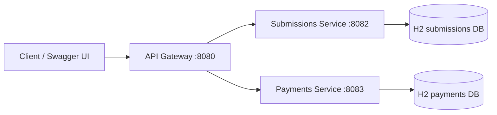

# Laundry Microservices Example

A small Spring Boot microservices demo built around an API gateway, JWT authentication, Swagger/OpenAPI, and isolated H2-backed services.

I used an API Gateway as the single entry point for the frontend. It handled routing requests to the appropriate Spring Boot microservice, while authentication and authorization were handled using JWT. The individual services were responsible for their own business logic and persistence using Hibernate/JPA. We could then independently deploy and scale services such as submissions and payments.

## Overview



The gateway issues and validates JWT tokens, then forwards requests to downstream services. Each service has its own in-memory database and its own Swagger UI.

## Services

| Service | Port | Purpose |
| --- | --- | --- |
| Gateway | 8080 | Authenticates JWT and routes requests |
| Submissions service | 8082 | Manages submissions |
| Payments service | 8083 | Manages payments |

## Features

- Spring Boot 4.1.0
- Spring Security for JWT-protected gateway routes
- Springdoc OpenAPI / Swagger UI on all services
- Hibernate / JPA with H2 for local development
- Docker and Docker Compose support

## Prerequisites

- Java 21 for the gateway
- Java 17 for the downstream services
- Maven Wrapper (`./mvnw`)
- Docker and Docker Compose if you want to run the stack in containers

## Run Locally

Start each service in a separate terminal.

Gateway:

```bash
./mvnw -f microservices/gateway/pom.xml spring-boot:run
```

Submissions service:

```bash
./mvnw -f microservices/submissions-service/pom.xml spring-boot:run
```

Payments service:

```bash
./mvnw -f microservices/payments-service/pom.xml spring-boot:run
```

## Run With Docker

Build the service jars first, then start everything with Compose:

```bash
./mvnw -f microservices/submissions-service/pom.xml -DskipTests package
./mvnw -f microservices/payments-service/pom.xml -DskipTests package
./mvnw -f microservices/gateway/pom.xml -DskipTests package
docker-compose up --build
```

## Swagger URLs

- Gateway: http://localhost:8080/swagger-ui.html
- Submissions service: http://localhost:8082/swagger-ui.html
- Payments service: http://localhost:8083/swagger-ui.html

OpenAPI JSON is available at `/v3/api-docs` on each service.

## API Flow

1. Request a JWT from the gateway.
2. Call the gateway routes with `Authorization: Bearer <token>`.
3. The gateway validates the token and forwards the request.
4. The downstream service stores or returns data from its own H2 database.

## Get a JWT

```bash
curl "http://localhost:8080/auth/token?userId=alice&role=user"
```

## Sample Requests

Create a token variable:

```bash
TOKEN=$(curl -s "http://localhost:8080/auth/token?userId=alice&role=user" | sed -E 's/.*"token":"([^"]+)".*/\1/')
```

Create a submission:

```bash
curl -X POST "http://localhost:8080/api/submissions" \
  -H "Authorization: Bearer $TOKEN" \
  -H "Content-Type: application/json" \
  -d '{"title":"Gateway submission"}'
```

List submissions:

```bash
curl -X GET "http://localhost:8080/api/submissions" \
  -H "Authorization: Bearer $TOKEN"
```

Create a payment:

```bash
curl -X POST "http://localhost:8080/api/payments" \
  -H "Authorization: Bearer $TOKEN" \
  -H "Content-Type: application/json" \
  -d '{"amount":39.99,"currency":"USD"}'
```

List payments:

```bash
curl -X GET "http://localhost:8080/api/payments" \
  -H "Authorization: Bearer $TOKEN"
```

## Gateway Routes

- `GET /auth/token` returns a signed JWT
- `GET /api/submissions` lists submissions
- `POST /api/submissions` creates a submission
- `GET /api/payments` lists payments
- `POST /api/payments` creates a payment

## Notes

- JWT validation happens in the gateway, not in the downstream services.
- The gateway forwards `X-User-Id` and `X-User-Role` headers.
- H2 is used only for local development.
- If ports 8080, 8082, or 8083 are already in use, stop the running process before starting the services again.


pids=$(lsof -ti tcp:8082); if [[ -n "$pids" ]]; then kill -9 $pids; fi; cd microservices/submissions-service && ../../mvnw spring-boot:run
